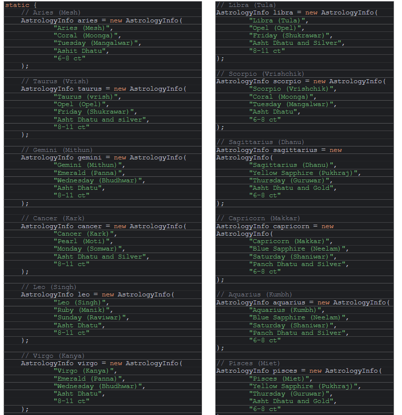
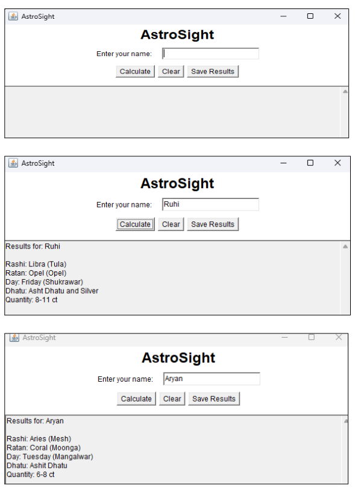

# AstroSight - Horoscope Predictor Using Java

### Made By:

- [Aryan Khatri](https://github.com/aryanDevAK)
- [Ruhi Sharma](https://github.com/ruhi-analyst)

---

## About

AstroSight is a horoscope prediction tool developed using **Java**, designed to provide users with personalized astrological insights based on their zodiac signs.

The system employs a robust algorithm to generate predictions. AstroSight is currently built for the command line, allowing users to input their names to receive accurate astrological forecasts.

By leveraging object-oriented programming in **Java**, AstroSight incorporates:

- Structured data handling
- Efficient algorithms
- Modular code

This ensures scalability and flexibility for future updates. The use of **Java** guarantees high performance and seamless integration.

AstroSight aims to make astrology accessible and engaging for a wide audience, combining the mystical world of horoscopes with the precision of technology. It offers users a personalized glimpse into their cosmic journey.

---

## Screenshots

### Sample Astro Data

### Sample Output

---
